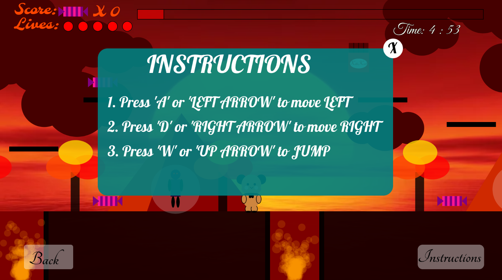

GAME STORY: 

In a realm not so distant, a charming duo, Dudu and Bubu, shared their lives. 
One fateful evening, as Dudu/Bubu returned home with a trove of chocolates, 
they discovered an unsettling silence. Their cherished partner (Dudu/Bubu) was 
nowhere to be found. Panic set in, and the search began. Hours passed, and by midnight,
 every friend's abode had been scoured to no avail. The search led Dudu/Bubu to a mystical realm
known as the Pink World. Braving enchanted rivers, dense forests, and towering mountains,
they confronted adversaries at every turn. Their determination culminated in a chilling discovery:
their beloved was trapped in a sinister mansion.

FIND HIM/HER AND HELP THEM TO BE REUNITED.

GAME FEATURES:
* Choosing different characters
* Have three game levels
* Levels unlocking system
* Instructions for how to play
* Pleasing sound effects
* Challenging enemies
* Chance to get extra life
* Timer

CODES:
* Codes are in JavaScript
* Library used: p5.js and p5.sound.js

🖼️ PREVIEW:

NOTE: This was my fisrt year's final project in Introduction to programming I at University of London and got 95 for it.
